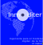

# **Linea gráfica de Inmoditer S.A.C** ⚡🔖⚡

## 💠 **Inmoditer Box**

<table style="width:100%">
  <tr>
    <th></th>
    <th></th>
    <th></th>
  </tr>
  <tr>
    <td></td>
    <td></td>
    <td></td>
  </tr>
</table>

## 💠 **Inmoditer Hexagon**

<table style="width:100%">
  <tr>
    <th></th>
    <th></th>
    <th></th>
  </tr>
  <tr>
    <td></td>
    <td></td>
    <td></td>
  </tr>

